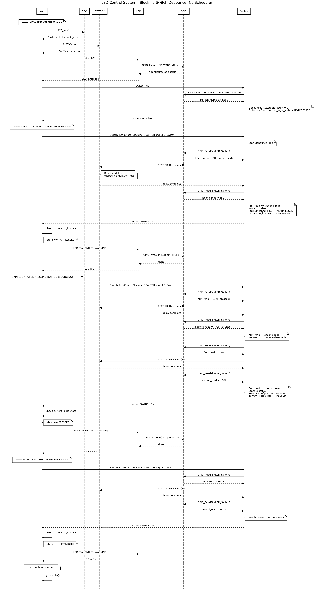
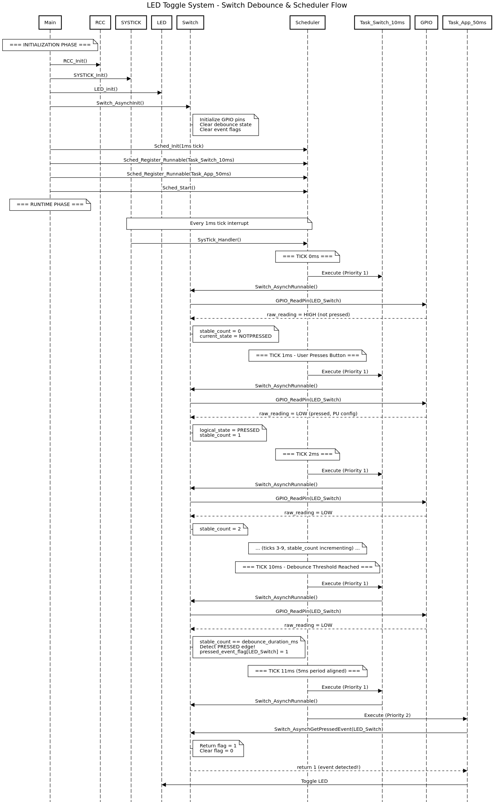

# 🔘 Switch Driver for STM32

A configurable switch/button driver with **software debouncing** for STM32 microcontrollers.

---

## 📁 File Structure

```
├── SWITCH.h                      # Interface header (API declarations & data types)
├── SWITCH_cfg.h                  # Configuration header (switch names enumeration)
├── SWITCH.c                      # Driver implementation
├── SWITCH_cfg.c                  # Switch configuration array
├──  SynchFuncTest.c              # Test Without Schedular
├── AsynchFuncTest.c              # Test With Schedular
├── Seq_diagramWithSched.png
└── Seq_diagramWithoutSched.png
```

---

## 📦 Data Structures

### Switch Configuration Structure

```c
typedef struct 
{
    void *Port;                          // GPIO Port (GPIOA, GPIOB, ...)
    GPIO_Pin_t Pin;                      // GPIO Pin number
    Switch_Resistor_Config_t resistor_cfg; // Pull-up/Pull-down config
    uint32_t debounce_duration_ms;       // Debounce time threshold
    Switch_Debounce_t DebounceState;     // Runtime debounce state
    uint8_t CurrentStatus;               // Current status
    uint8_t LastStatus;                  // Previous status
} SWITCH_cfg_t;
```

### Debounce State Structure

```c
typedef struct
{
    uint32_t last_read_time;                    // Timestamp of last read
    uint8_t stable_count;                       // Counter for stable readings
    uint8_t last_raw_state;                     // Previous raw GPIO reading
    Return_Button_State_t current_logic_state;  // Current debounced state
    Return_Button_State_t previous_logic_state; // Previous debounced state
} Switch_Debounce_t;
```

### Enumerations

```c
/* Pull resistor configuration */
typedef enum {
    Internal_PU,    // Internal Pull-Up (Active LOW)
    External_PU,    // External Pull-Up (Active LOW)
    Internal_PD,    // Internal Pull-Down (Active HIGH)
    External_PD,    // External Pull-Down (Active HIGH)
    floating        // No pull resistor
} Switch_Resistor_Config_t;

/* Debounced button state */
typedef enum {
    NOTPRESSED,     // Button is not pressed
    PRESSED         // Button is pressed
} Return_Button_State_t;

/* Function return status */
typedef enum {
    SWITCH_Ok,          // Success
    SWITCH_NOT_NULL_PTR,// Null pointer error
    SWITCH_INVALID      // Invalid parameter
} switch_status_t;
```

---

## 🔧 Driver Modes

The driver supports **two operational modes**:

| Mode | Function | Use Case |
|------|----------|----------|
| **Blocking** | `Switch_ReadState_Blocking()` | Simple applications, no scheduler |
| **Asynchronous** | `Switch_AsynchRunnable()` | Scheduler/RTOS based systems |

---

## ⚙️ How It Works

### 1. Blocking Mode

```
┌──────────────────────────────────────────────────┐
│            Switch_ReadState_Blocking()           │
├──────────────────────────────────────────────────┤
│                                                  │
│   ┌─────────┐                                    │
│   │  START  │                                    │
│   └────┬────┘                                    │
│        ▼                                         │
│   ┌─────────────────┐                            │
│   │ Read GPIO (1st) │                            │
│   └────────┬────────┘                            │
│            ▼                                     │
│   ┌─────────────────┐                            │
│   │ Delay (10ms)    │  ◄── debounce_duration_ms  │
│   └────────┬────────┘                            │
│            ▼                                     │
│   ┌─────────────────┐                            │
│   │ Read GPIO (2nd) │                            │
│   └────────┬────────┘                            │
│            ▼                                     │
│   ┌─────────────────┐     NO                     │
│   │ 1st == 2nd ?    │─────────┐                  │
│   └────────┬────────┘         │                  │
│            │ YES              │                  │
│            ▼                  │                  │
│   ┌─────────────────┐         │                  │
│   │ Update State    │         │                  │
│   │ Return OK       │         │                  │
│   └─────────────────┘         │                  │
│            ▲                  │                  │
│            └──────────────────┘                  │
│                  (Repeat)                        │
└──────────────────────────────────────────────────┘
```

**Logic:** Waits until two consecutive readings (separated by debounce delay) are identical.
#### Sequence Diagram

  

---

### 2. Asynchronous Mode

```
┌──────────────────────────────────────────────────────────────┐
│              Switch_AsynchRunnable() - Called Every 1ms      │
├──────────────────────────────────────────────────────────────┤
│                                                              │
│   ┌─────────┐                                                │
│   │  START  │                                                │
│   └────┬────┘                                                │
│        ▼                                                     │
│   ┌─────────────────────┐                                    │
│   │ Read GPIO Pin       │                                    │
│   └──────────┬──────────┘                                    │
│              ▼                                               │
│   ┌─────────────────────┐                                    │
│   │ Convert to Logical  │  PU: LOW=PRESSED, HIGH=NOTPRESSED  │
│   │ State               │  PD: HIGH=PRESSED, LOW=NOTPRESSED  │
│   └──────────┬──────────┘                                    │
│              ▼                                               │
│   ┌─────────────────────┐                                    │
│   │ Same as last read?  │                                    │
│   └──────────┬──────────┘                                    │
│         YES  │  NO                                           │
│   ┌──────────┴──────────┐                                    │
│   ▼                     ▼                                    │
│ ┌───────────┐    ┌─────────────┐                             │
│ │ stable_   │    │ stable_     │                             │
│ │ count++   │    │ count = 0   │                             │
│ └─────┬─────┘    └─────────────┘                             │
│       ▼                                                      │
│ ┌─────────────────────┐                                      │
│ │ count == threshold? │                                      │
│ └──────────┬──────────┘                                      │
│       YES  │  NO                                             │
│   ┌────────┴────────┐                                        │
│   ▼                 ▼                                        │
│ ┌───────────┐  ┌─────────┐                                   │
│ │ Detect    │  │ Wait    │                                   │
│ │ Edge &    │  │ (do     │                                   │
│ │ Set Flag  │  │ nothing)│                                   │
│ └───────────┘  └─────────┘                                   │
│                                                              │
└──────────────────────────────────────────────────────────────┘
```

**Logic:** Counts consecutive identical readings. When count reaches threshold, state is confirmed stable.

#### Sequence Diagram
  
  
  
---

## 🎯 Edge Detection (Async Mode Only)

The driver detects **two types of edges**:

```
Button Timeline:
                    ┌─────────────────────────┐
                    │                         │
    NOTPRESSED ─────┘                         └───── NOTPRESSED
                    ▲                         ▲
                    │                         │
              PRESSED EVENT            RELEASED EVENT
              (Rising Edge)            (Falling Edge)
```

### Event Flags

| Flag | Set When | Cleared When |
|------|----------|--------------|
| `pressed_event_flags[i]` | Button transitions: NOTPRESSED → PRESSED | After `Switch_AsynchGetPressedEvent()` is called |
| `released_event_flags[i]` | Button transitions: PRESSED → NOTPRESSED | After `Switch_AsynchGetReleasedEvent()` is called |

**Important:** Event flags are **one-shot** — they auto-clear after reading!

---

## 🔌 Pull Resistor Logic

### Pull-Up Configuration (Active LOW)

```
   VCC (3.3V)
       │
      ┌┴┐
      │ │ Pull-Up Resistor
      └┬┘
       │
       ├─────── GPIO Pin ─────► Read HIGH (NOTPRESSED)
       │
      ┌┴┐
      │ │ Switch
      └┬┘
       │
      GND
       
When switch pressed: GPIO = LOW → PRESSED
When switch open:    GPIO = HIGH → NOTPRESSED
```

### Pull-Down Configuration (Active HIGH)

```
   VCC (3.3V)
       │
      ┌┴┐
      │ │ Switch
      └┬┘
       │
       ├─────── GPIO Pin ─────► Read LOW (NOTPRESSED)
       │
      ┌┴┐
      │ │ Pull-Down Resistor
      └┬┘
       │
      GND

When switch pressed: GPIO = HIGH → PRESSED
When switch open:    GPIO = LOW → NOTPRESSED
```

---

## 📋 API Summary

### Initialization

| Function | Mode | Description |
|----------|------|-------------|
| `Switch_Init()` | Blocking | Initialize for blocking mode |
| `Switch_AsynchInit()` | Async | Initialize for async mode |

### Reading State

| Function | Mode | Description |
|----------|------|-------------|
| `Switch_ReadState_Blocking()` | Blocking | Read with blocking debounce |
| `Switch_AsynchRunnable()` | Async | Process debounce (call periodically) |
| `Switch_AsynchGetState()` | Async | Get current debounced state |
| `Switch_AsynchGetPressedEvent()` | Async | Check for press edge (auto-clears) |
| `Switch_AsynchGetReleasedEvent()` | Async | Check for release edge (auto-clears) |

---

## 🔄 Debounce Timing

### Example: 10ms Debounce with 1ms Tick

```
Time(ms):   0    1    2    3    4    5    6    7    8    9    10   11
            │    │    │    │    │    │    │    │    │    │    │    │
Raw Read:   H    L    L    L    H    L    L    L    L    L    L    L
                              ↑                              ↑
                           Bounce!                        Stable!
                           
Counter:    0    1    2    3    0    1    2    3    4    5    6    ...
                              ↑                              ↑
                           Reset                     Threshold=10
                           to 0                      State Updated!
```


## 🏗️ Internal Variables

```c
/* Event flags for edge detection */
static uint8_t pressed_event_flags[Switch_LEN];   // Press events
static uint8_t released_event_flags[Switch_LEN];  // Release events

/* GPIO configuration storage */
GPIO_PinConfig_t switch_pin_GPIO[Switch_LEN];     // GPIO settings

/* External configuration array (defined in SWITCH_cfg.c) */
extern SWITCH_cfg_t SWITCH_cfg[Switch_LEN];       // User config
```

---

## ⚡ Key Implementation Details

1. **Non-const Configuration:** `SWITCH_cfg[]` is NOT const because runtime debounce state is stored inside it.

2. **Edge Detection Once:** Events trigger only when `stable_count == threshold`, not `>=`, preventing repeated triggers.

3. **Auto-clear Events:** `GetPressedEvent()` and `GetReleasedEvent()` clear flags after reading.

4. **Pull Configuration:** Logical state conversion happens inside driver based on `resistor_cfg`.

5. **Independent Debounce:** Each switch has its own `debounce_duration_ms` and counter.

---

## 📝 Author

**Abdelfattah Moawed**  
