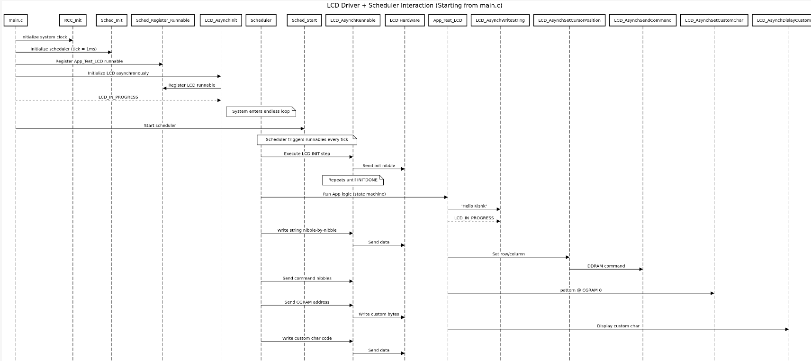

# HD44780 LCD Driver (HAL)

A Hardware Abstraction Layer (HAL) driver for standard Alphanumeric LCDs (Hitachi HD44780 compatible). This driver is designed for embedded systems and offers two distinct modes of operation: **Synchronous (Blocking)** and **Asynchronous (Non-Blocking)**.

## 🚀 Features

*   **Dual Operation Modes:**
    *   **Synchronous:** Uses blocking delays. Simple to implement for bare-metal loops.
    *   **Asynchronous:** Completely non-blocking. Integrates with a Scheduler/OS to allow multitasking.
*   **Hardware Flexibility:** Configurable GPIO ports and pins for Data and Control lines.
*   **Text Manipulation:** Write characters, strings, and control cursor position.
*   **Custom Characters:** Support for defining and displaying custom bitmaps (CGRAM).

---

## ⚙️ Operation Modes

### 1. Synchronous Mode (Blocking)
In this mode, the CPU waits inside the function until the LCD command is fully processed. It relies on `SYSTICK_Delay` for timing.

*   **Supported Interfaces:** 4-Bit Mode AND 8-Bit Mode.
*   **Use Case:** System initialization before the OS starts, or simple applications without strict timing requirements.

### 2. Asynchronous Mode (Non-Blocking)
In this mode, API calls return immediately with a status. The actual hardware toggling happens in a periodic `Runnable` task managed by a Scheduler. This ensures the CPU is never blocked waiting for the slow LCD hardware.

*   **Supported Interfaces:** **4-Bit Mode ONLY**.
*   **Dependencies:** Requires `sched.h` (Scheduler).
*   **Use Case:** Real-time applications where the CPU must handle other tasks while the LCD updates.

---

## 🛠️ Configuration

Configure the LCD pins and hardware mode in `LCD_Cfg.c` and `LCD_Cfg.h`.

```c
/* LCD_Cfg.c Example */
LCD_Config LCDs[LCDs_Max] = {
    [CLCD] = {
        .RS_Port = GPIOA, .RS_Pin = GPIO_PIN0,
        .E_Port  = GPIOA, .E_Pin  = GPIO_PIN2,
        .Data_Port = { /* ... */ }, 
        .Data_Pin  = { /* ... */ },
        .mode = LCD_MODE_4BIT // Required for Asynchronous Mode
    }
};
```

---

## 📊 Sequence Diagram (Asynchronous Operation)

The following diagram illustrates how the Application, Scheduler, and LCD Driver interact during an asynchronous write operation.



*(Note: The App requests a write, the Driver returns `BUSY` while initializing, and eventually accepts the command, processing it over multiple scheduler ticks).*

---

## 📚 API Reference

### Synchronous APIs
```c
LCD_Status_t LCD_Init(LCD_Config *config);
LCD_Status_t LCD_WriteString(LCD_Config *config, const uint8_t *string);
LCD_Status_t LCD_WriteChar(LCD_Config *config, uint8_t character);
LCD_Status_t LCD_SetCursorPosition(LCD_Config *config, uint8_t row, uint8_t column);
LCD_Status_t LCD_SetCustomChar(LCD_Config *config, uint8_t location, uint8_t charmap[]);
LCD_Status_t LCD_Clear(LCD_Config *config);
```

### Asynchronous APIs
```c
/* Returns LCD_IN_PROGRESS if accepted, or LCD_BUSY if driver is busy */
LCD_Status_t LCD_AsynchInit(LCD_Config *config);
LCD_Status_t LCD_AsynchWriteString(LCD_Config *config, const uint8_t *string);
LCD_Status_t LCD_AsynchWriteChar(LCD_Config *config, const uint8_t *chr);
LCD_Status_t LCD_AsynchSetCursorPosition(LCD_Config *config, uint8_t row, uint8_t column);
LCD_Status_t LCD_AsynchSetCustomChar(LCD_Config *config, uint8_t location, uint8_t charmap[]);
LCD_Status_t LCD_AsynchDislayCustomChar(LCD_Config *config, uint8_t location);
```

---

## 💻 Usage Examples

### 1. Synchronous Example
```c
int main(void) {
    RCC_Init();
    /* Initialization blocks until complete */
    LCD_Init(&LCDs[CLCD]); 
    
    LCD_WriteString(&LCDs[CLCD], "Hello World");
    
    while(1);
}
```

### 2. Asynchronous Example (with Scheduler)
This requires a state machine approach in the Application Runnable.

```c
void App_Test_LCD(void *arg) {
    static uint8_t step = 0;
    LCD_Status_t status;

    switch (step) {
    case 0:
        /* Request Init */
        status = LCD_AsynchInit(&LCDs[CLCD]);
        if (status == LCD_IN_PROGRESS) step++;
        break;

    case 1:
        /* Keep retrying until Init is done and Driver is ready */
        status = LCD_AsynchWriteString(&LCDs[CLCD], "Async Text");
        if (status == LCD_IN_PROGRESS) step++;
        /* If status == LCD_BUSY, we stay in case 1 and try again next tick */
        break;
    }
}

int main(void) {
    Sched_Init(1);
    Sched_Register_Runnable(&App_Runnable); // App_Runnable calls App_Test_LCD
    Sched_Start();
}
```

---

## ⚠️ Limitations

1.  **Asynchronous Mode supports 4-Bit Mode only.**
