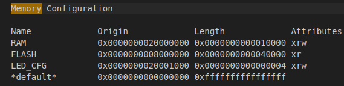
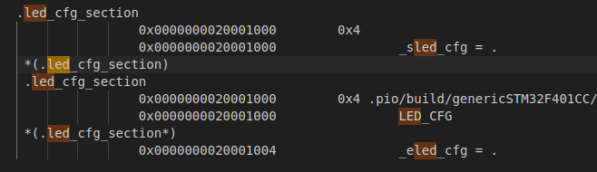
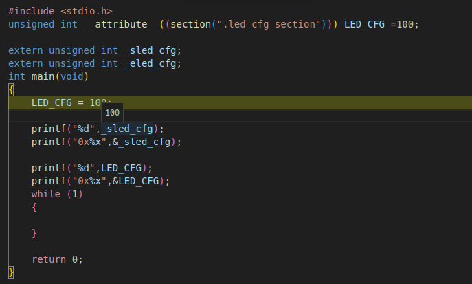

# Placing Variables in a Custom Memory Section (STM32 Example)

This guide explains how to place one or more variables at a specific memory region using a **custom linker script** for STM32 microcontrollers (works with **PlatformIO**).

## 🧠 Overview

By default, the compiler and linker decide where variables and code are stored in memory.  
Sometimes, you need to put specific data (like configuration flags or boot parameters) at a **fixed memory address**.  

In this guide, you will:
1. Define a **custom memory region** in the linker script  
2. Create a **custom section** for that memory region  
3. Declare and use variables from your C code  
4. Integrate the custom linker script into **PlatformIO**  
5. Understand **overflow and overlap** conditions  

---

## 🧩 1. Add a New Memory Region

In your custom linker script (e.g., `STM32F401CCFX_CUSTOM.ld`), add a new region to the `MEMORY` block:

```ld
MEMORY
{
  RAM     (xrw) : ORIGIN = 0x20000000, LENGTH = 64K
  FLASH   (rx)  : ORIGIN = 0x08000000, LENGTH = 256K
  LED_CFG (xrw) : ORIGIN = 0x20001000, LENGTH = 4
}
```

**Explanation:**
- `LED_CFG` starts at address `0x20001000`
- The region size (`LENGTH = 4`) allows for only **4 bytes** (enough for 1 `uint32_t` variable)

---

## 🧩 2. Create a Section for the Memory Region

Add a custom section tied to this region:

```ld
.led_cfg_section :
{
  _sled_cfg = .;
  *(.led_cfg_section)
  _eled_cfg = .;
} >LED_CFG
```

This section will hold all variables declared with `__attribute__((section(".led_cfg_section")))`.

---

## 💻 3. Declare Variable(s) in Application Code

Example in `main.c`:

```c
#include <stdio.h>

unsigned int __attribute__((section(".led_cfg_section"))) LED_CFG = 100;

extern unsigned int _sled_cfg;
extern unsigned int _eled_cfg;

int main(void)
{
    LED_CFG = 100;

    printf("Start of section: 0x%x\n", (unsigned int)&_sled_cfg);
    printf("LED_CFG address : 0x%x\n", (unsigned int)&LED_CFG);

    while (1) {}
}
```

### ⚠️ Important:
If you declare multiple elements in this region (e.g., `unsigned int LED_CFG[2];`), the total size **must not exceed** the region’s defined length.

---

## 🚨 4. Handling Overflow and Memory Overlap

### Example of Overflow:
```c
unsigned int __attribute__((section(".led_cfg_section"))) LED_CFG[2];
```

Each `unsigned int` is **4 bytes**, so this total is **8 bytes**.  
But the linker only allocated **4 bytes** (`LENGTH = 4`) for the `LED_CFG` region.

At link time, you’ll get an error similar to:
```
region LED_CFG overflowed by 4 bytes
```

### How to Fix It:
- Increase the region size in the linker script:
  ```ld
  LED_CFG (xrw) : ORIGIN = 0x20001000, LENGTH = 8
  ```
- Or, reduce your variable size.

---

### ⚠️ Avoid Overlapping Memory

You must ensure that your new memory region (`LED_CFG`) **does not overlap** with existing memory areas (like RAM).  

For example:
```ld
RAM     (xrw) : ORIGIN = 0x20000000, LENGTH = 64K
LED_CFG (xrw) : ORIGIN = 0x2000FFF0, LENGTH = 32
```

This region overlaps with the end of RAM (`0x20010000`), which can cause unexpected crashes or corruption.

#### To fix:
- Always align your region boundaries:
  - Ensure `ORIGIN + LENGTH` of `RAM` does not exceed or overlap with the start of your new section.
- You can verify this using the **map file** generated during linking (`output.map`).

---

## ⚙️ 5. PlatformIO Configuration

In your `platformio.ini`, link the custom linker script:

```ini
[env:genericSTM32F401CC]
platform = ststm32
board = genericSTM32F401CC
framework = cmsis
upload_protocol = stlink
debug_tool = stlink
build_type = debug

board_build.ldscript = STM32F401CCFX_CUSTOM.ld
build_flags = -Wl,-Map,output.map
```

Then build and verify the addresses using the generated **map file** (`output.map`).

Look for:
```
.led_cfg_section  0x20001000      0x4
 *(.led_cfg_section)
 LED_CFG          0x20001000
```



---

## 🧠 6. Initialization Behavior

By default, the STM32 startup file does **not** copy initial values for custom memory sections like `.led_cfg_section` from Flash to RAM.  
That means if you use debugger reset or soft reset, variables may not be initialized properly.

### To fix:
- Initialize manually in your code (`LED_CFG = 100;`), or
- Modify the startup file to copy from Flash to RAM (only if persistence of initial values is needed).

---

## ✅ Summary

| Step | Description | File |
|------|--------------|------|
| 1 | Add new memory region | `STM32F401CCFX_CUSTOM.ld` |
| 2 | Define custom section | `STM32F401CCFX_CUSTOM.ld` |
| 3 | Declare variable in code | `main.c` |
| 4 | Configure linker in PlatformIO | `platformio.ini` |
| 5 | Watch for overflow or overlap | (check during linking / `output.map`) |

---
